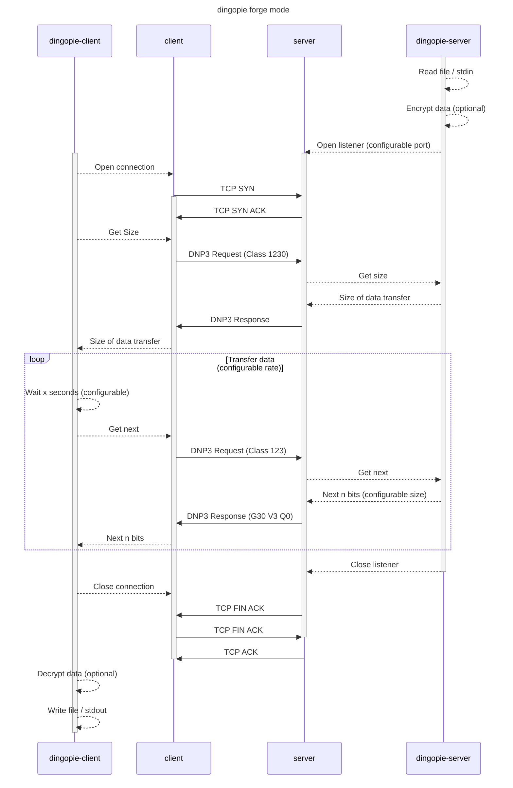

# dingopie :wolf: :cake:

> [D1N0P13](https://github.com/nblair2/d1n0p13) in Go... and better

```
   |\_/|     ▌▘        ▘       ) (
  /     \   ▛▌▌▛▌▛▌▛▌▛▌▌█▌    ) ( )
 /_ ~ ~ _\  ▙▌▌▌▌▙▌▙▌▙▌▌▙▖  .:::::::.
    \@/          ▄▌  ▌     ~\_______/~
```
## Modes

### Forge

In forge mode, dingopie crafts its own DNP3 messages. Data is sent in DNP3 Application Objects. This traffic will be legitimate protocol-conforming DNP3, but is noticeable. It will originate on a port and host that are not usually communicating using DNP3, and traffic inspection will likely show unusual usage, both in the amount of data transferred and the DNP3 characteristics. The advantage of forge mode is that it can be configured to run at high speeds, between any two devices.



#### Forge Server (outstation)

```
Usage:
  dingopie-forge-server {"my message" | -f file.txt} [flags]

Examples:
  dingopie-forge-server -f /path/to/file.txt
  dingopie-forge-server "my secret message inline" -p 20001 -k "password"

Flags:
  -f, --file string   file to read data from (default is read from command line)
  -p, --port uint16   port to listen for DNP3 connections on (default 20000)
  -k, --key string    encryption key (default is no encryption)
  -o, --objects int   number of 32bit objects to send in each response. Higher for increased bandwidth (default 10)
  -h, --help          help for dingopie-forge-server
```

#### Forge Client (master)

```
Usage:
  dingopie-forge-client <server ip address> [flags]

Examples:
  dingopie-forge-client 1.2.3.4
  dingopie-forge-client 1.2.3.4 -p 20001 -f out.txt -k "password"

Flags:
  -p, --port uint16    port to connect to DNP3 server (default 20000)
  -k, --key string     encryption key (default is no encryption)
  -w, --wait float32   wait in seconds between polls to the server, lower for increased bandwidth (default 5)
  -f, --file string    file to write data to (default is write to command line)
  -h, --help           help for dingopie-forge-client
```

### Filter

> [!NOTE] 
> :exclamation: **filter mode is not implemented** :exclamation:
> For a (very slow) POC, see the original [D1N0P13](https://github.com/nblair2/d1n0p13

In filter mode, dingopie 'rides on top of' an existing DNP3 channel. It will intercept and add data to packets as they leave one host, and on the other side will intercept and remove this data before allowing the packets to continue on to the legitimate SCADA program. This will increase the size of packets sent between devices, but will take place over an existing DNP3 connection and is much less likely to be noticed. The disadvantage of filter mode is that its speed is constrained by the channel that it is using.